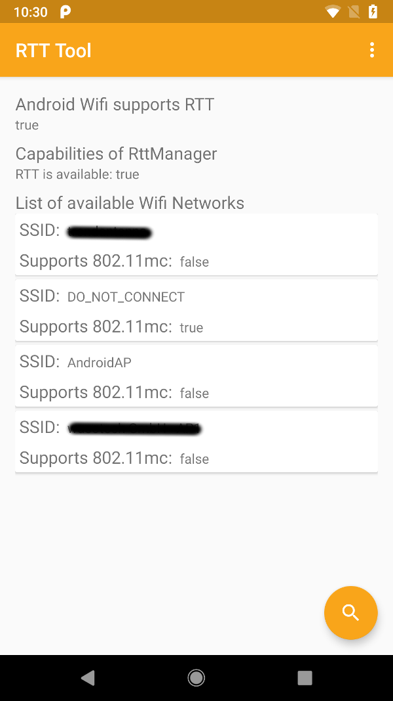

# Android RTT Manager Sample

This is a sample project using the Android `android.net.wifi.rtt.WifiRttManager`, which was introduced with Android P.

The sample consists of two screens:

## WiFi Selection screen
The WiFi selection screen shows the general capabilities of the smartphone and after clicking on the search FAB button a WiFi scan is performed. Available WiFi's are listed and for each detected WiFi it is noticed whether the network supports RTT or not.



## Ranging screen
After clicking on a WiFi that supports RTT measurements, the Ranging screen will popup.
Via the buttons "Start Ranging" and "Stop Ranging" RTT measurements can be performed. The result of each measurement will be presented in the TextView in the format:

```
<timestamp> RSSI: <rssi> Distance: <distance> mm
```


## Notes
* Your smartphone has to support the IEEE 802.11mc standard by hardware. (e.g. has Qualcomm Snapdragon 820 CPU)
* Your Access Point used for RTT ranging has to support the IEEE 802.11mc standard as well. Unfortunately I don't know any public available hardware up to now.
